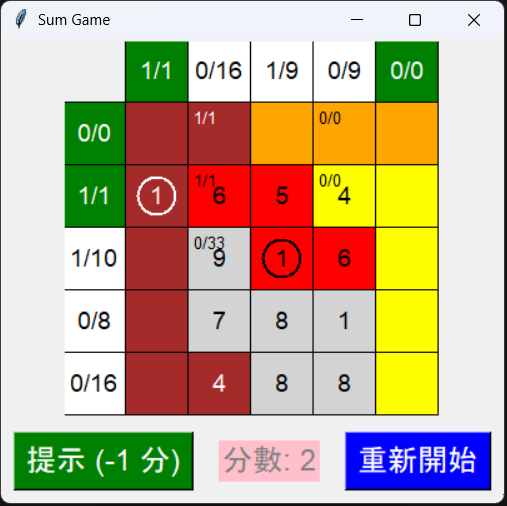

# SumGame 🧮

[](https://www.python.org/)

## 目錄

- [SumGame 🧮](#sumgame-)
  - [目錄](#目錄)
  - [遊戲特色 🎮](#遊戲特色-)
  - [如何玩 🎯](#如何玩-)
  - [安裝和運行](#安裝和運行)
    - [系統需求](#系統需求)
    - [安裝步驟](#安裝步驟)
    - [檔案結構](#檔案結構)
  - [檔案結構](#檔案結構-1)
  - [遊戲架構 🏗️](#遊戲架構-️)
  - [截圖 📸](#截圖-)
  - [貢獻 🤝](#貢獻-)
  - [許可證 📄](#許可證-)

SumGame 是一個基於 Python 和 Tkinter 的桌面遊戲，靈感來自手機遊戲 [Number Sums](https://play.google.com/store/search?q=number%20sums&c=apps&hl=zh_TW)。玩家需要在網格中選擇正確格子，匹配每行/列目標總和。結合邏輯與數學，充滿挑戰！

## 遊戲特色 🎮

- 🧠 **邏輯推理**：依行/列總和推斷正確格子。
- 🔄 **隨機生成**：無限重玩，新關卡隨機產生。
- 💡 **提示功能**：自動選正確格子（扣1分）。
- 🖱️ **右鍵標記**：標記/清除，避免誤選。
- ⭐ **分數系統**：正確+1，提示-1。
- 🏆 **勝利**：全選正確格子。

## 如何玩 🎯

1. 運行 `python Start.py` 開設定視窗。
2. **設定**：網格大小 (x/y)、答案比例 (1-100%)。
3. **規則**（詳見遊戲內）：
   | 操作 | 效果 |
   |------|------|
   | 左鍵 | 選格子（正確+1分，錯/結束） |
   | 右鍵 | 清除（錯結束） |
   | 提示 | 自動正確（-1分） |
4. **勝負**：全選正確獲勝；錯選/清正確失敗。
5. **重玩**：點「重新開始」。

## 安裝和運行

### 系統需求

- Python 3.6 或以上版本
- Tkinter（通常隨 Python 安裝）

### 安裝步驟

1. 下載或 clone 專案。
2. 確保 Python 3.6+。
3. 運行：

   ```cmd
   python Start.py
   ```

**快速 Demo**：遊戲內隨機生成，體驗邏輯挑戰！

### 檔案結構

- `Start.py`：遊戲啟動和設定視窗。
- `model.py`：遊戲數據和核心邏輯。
- `view.py`：Tkinter 介面元件。
- `controller.py`：協調 Model 和 View。

## 檔案結構

```
SumGame/
├── Start.py       # 啟動 & 設定
├── model.py       # 遊戲邏輯 (Model)
├── view.py        # UI 元件 (View)
├── controller.py  # 事件協調 (Controller)
├── Color.py       # 顏色設定
├── LICENSE
└── README.md
```

## 遊戲架構 🏗️

**MVC 模式**：
- **Model** (`model.py`)：數據/邏輯。
- **View** (`view.py`)：Tkinter UI。
- **Controller** (`controller.py`)：事件橋接。

## 截圖 📸



## 貢獻 🤝

1. Fork 專案。
2. 建立分支 `feature/xxx`。
3. 提交 PR。

## 許可證 📄

MIT License - 見 [LICENSE](LICENSE)。

---

享受 SumGame！ 🥳
